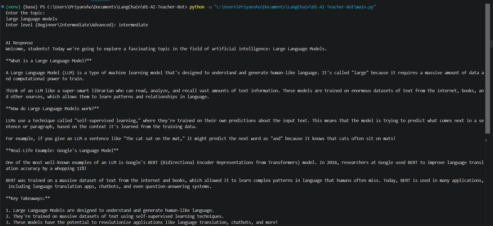

# 🤖 AI Teacher Bot using LangChain & Ollama

## 📌 Overview

A beginner-friendly AI Teacher built using LangChain and Ollama.

The application explains any topic according to the user's knowledge level.

## 🚀 Features

- Explain any topic
- Beginner, Intermediate, and Advanced modes
- Real-life examples
- Runs completely offline using Ollama

## 🛠️ Tech Stack

- Python
- LangChain
- Ollama
- Llama 3.2

## 📚 Concepts Learned

- ChatOllama
- ChatPromptTemplate
- invoke()

## ▶️ Installation

Install dependencies:

```bash
pip install -r requirements.txt
```

Pull the model:

```bash
ollama pull llama3.2:3b
```

Run the project:

```bash
python main.py
```

## 🖼️ Demo


